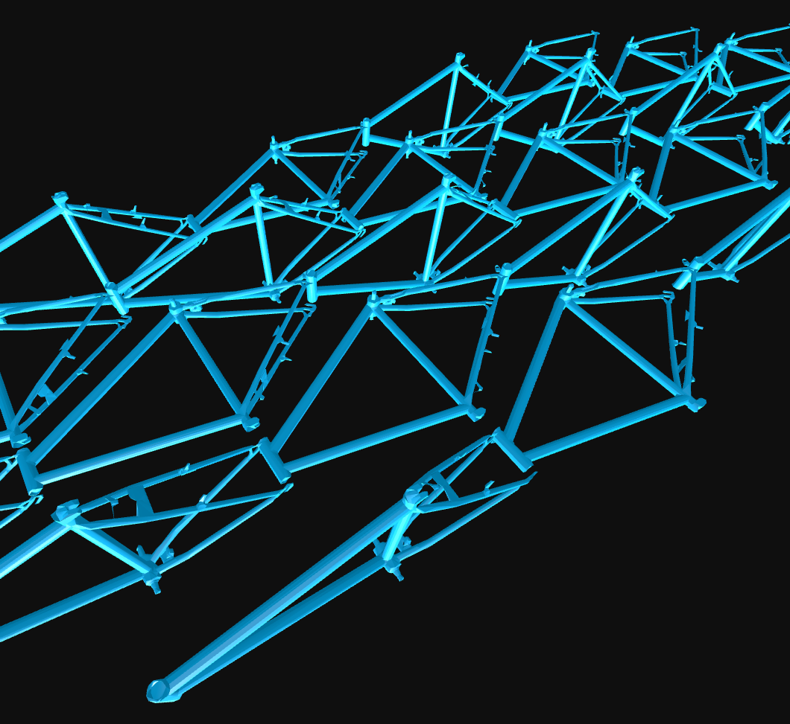
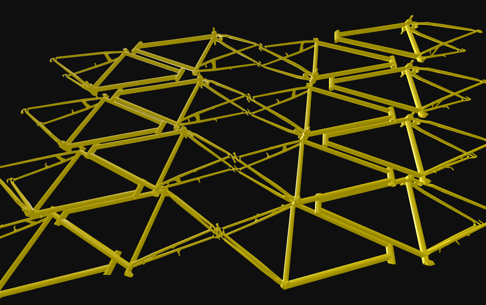
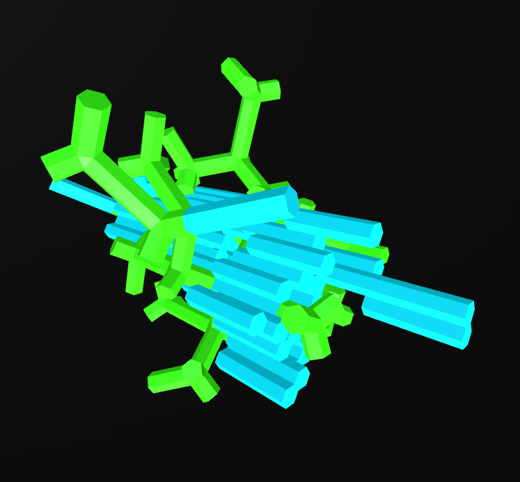
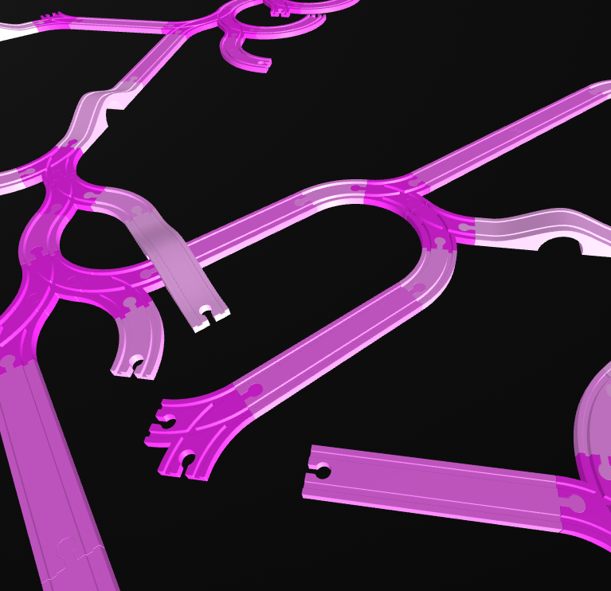
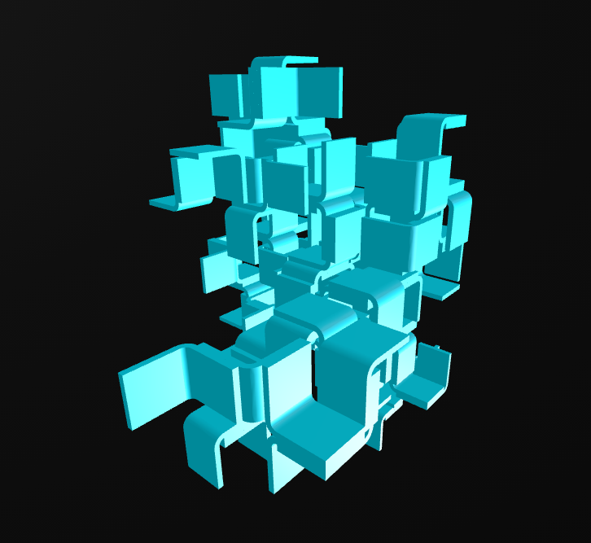

# Wasp-Atlas Collection
Collection of reusable Aggregation systems for the Wasp Framework

## Available systems

<!-- AUTO-LIST:START -->

<table width="100%">
  <tbody>
    <tr>
      <td width="50%" valign="top">

<table>
  <tr>
    <td width="90">
      
    </td>
    <td>
      <strong><a href="systems/bike-frames-pattern-01">Bike Frames - Pattern 01</a></strong> 
      by Lukas Allner, Daniela Kröhnert, Naomi Neururer, Andrea Rossi 
      <code>inventorics</code> <code>reuse</code> <code>bikes</code> 
      <a href="systems/bike-frames-pattern-01/aggregation.json">aggregation.json</a> · <a href="systems/bike-frames-pattern-01/meta.json">meta.json</a>
    </td>
  </tr>
</table>
      </td>
      <td width="50%" valign="top">

<table>
  <tr>
    <td width="90">
      
    </td>
    <td>
      <strong><a href="systems/bike-frames-pattern-04">Bike Frames - Pattern 04</a></strong> 
      by Lukas Allner, Daniela Kröhnert, Naomi Neururer, Andrea Rossi 
      <code>inventorics</code> <code>reuse</code> <code>bikes</code> 
      <a href="systems/bike-frames-pattern-04/aggregation.json">aggregation.json</a> · <a href="systems/bike-frames-pattern-04/meta.json">meta.json</a>
    </td>
  </tr>
</table>
      </td>
    </tr>
    <tr>
      <td width="50%" valign="top">

<table>
  <tr>
    <td width="90">
      
    </td>
    <td>
      <strong><a href="systems/branching-sticks">Branching Sticks</a></strong> 
      by Andrea Rossi 
      <code>example</code> 
      <a href="systems/branching-sticks/aggregation.json">aggregation.json</a> · <a href="systems/branching-sticks/meta.json">meta.json</a>
    </td>
  </tr>
</table>
      </td>
      <td width="50%" valign="top">

<table>
  <tr>
    <td width="90">
      
    </td>
    <td>
      <strong><a href="systems/brio-rails">Brio Rails</a></strong> 
      by Roger Winkler 
      <code>toy</code> <code>construction kit</code> <code>brio</code> 
      <a href="systems/brio-rails/aggregation.json">aggregation.json</a> · <a href="systems/brio-rails/meta.json">meta.json</a>
    </td>
  </tr>
</table>
      </td>
    </tr>
    <tr>
      <td width="50%" valign="top">

<table>
  <tr>
    <td width="90">
      
    </td>
    <td>
      <strong><a href="systems/corner-shape">Corner Shape</a></strong> 
      by Andrea Rossi 
      <code>examples</code> <code>simple</code> 
      <a href="systems/corner-shape/aggregation.json">aggregation.json</a> · <a href="systems/corner-shape/meta.json">meta.json</a>
    </td>
  </tr>
</table>
      </td>
      <td width="50%" valign="top">

<table>
  <tr>
    <td width="90">
      
    </td>
    <td>
      <strong><a href="systems/gyrobifastigium">Gyrobifastigium</a></strong> 
      by Andrea Rossi 
      <code>geometry</code> <code>solids</code> <code>space filling</code> 
      <a href="systems/gyrobifastigium/aggregation.json">aggregation.json</a> · <a href="systems/gyrobifastigium/meta.json">meta.json</a>
    </td>
  </tr>
</table>
      </td>
    </tr>
    <tr>
      <td width="50%" valign="top">

<table>
  <tr>
    <td width="90">
      
    </td>
    <td>
      <strong><a href="systems/vertex-octahedra">Vertex Octahedra</a></strong> 
      by Andrea Rossi 
      <code>geometry</code> <code>platonic</code> <code>example</code> 
      <a href="systems/vertex-octahedra/aggregation.json">aggregation.json</a> · <a href="systems/vertex-octahedra/meta.json">meta.json</a>
    </td>
  </tr>
</table>
      </td>
      <td width="50%" valign="top">
&nbsp;
      </td>
    </tr>
  </tbody>
</table>

<!-- AUTO-LIST:END -->
