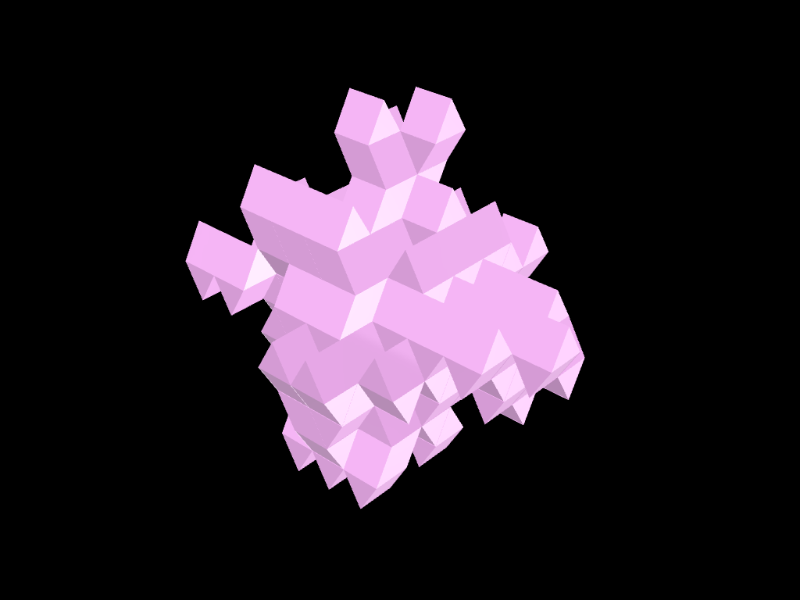

# Gyrobifastigium

## Description

Space filling aggregation of Gyrobifastigium solids, from the Wasp Example Files collection.

## Information

| Field | Value |
|---|---|
| Slug | `gyrobifastigium` |
| Author | [Andrea Rossi](https://thecomputationalhive.com/) |
| License | GPL-3.0 |
| Tags | `geometry` `solids` `space filling` |
| Software | v0.6... |
| Units | Centimeters |
| Parts | 1 |
| Rules | 24 |

## Files

- [aggregation.json](aggregation.json)
- [meta.json](meta.json)

---

This README was generated automatically from `meta.json`.
