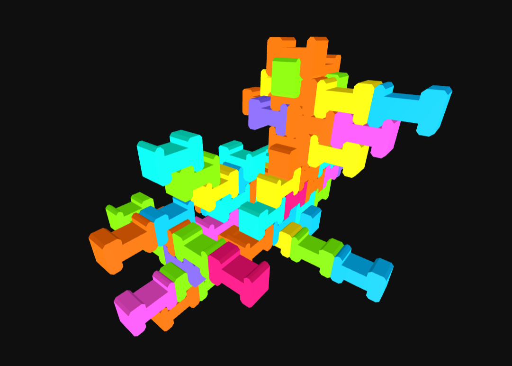

# Interlocking Bricks

## Description

Simple interlocking brick for robotic assembly. Used for the paper "Collaborative Assembly of Digital Materials" (Rossi & Tessmann, 2017)

## Information

| Field | Value |
|---|---|
| Slug | `interlocking-bricks` |
| Author | [Andrea Rossi](https://www.dg.architektur.tu-darmstadt.de) |
| License | GPL-3.0 |
| Tags | `interlocking` `robotic assembly` `brick` |
| Software | v0.7... |
| Units | Millimeters |
| Parts | 1 |
| Rules | 5 |

## Files

- [aggregation.json](aggregation.json)
- [meta.json](meta.json)

---

This README was generated automatically from `meta.json`.
