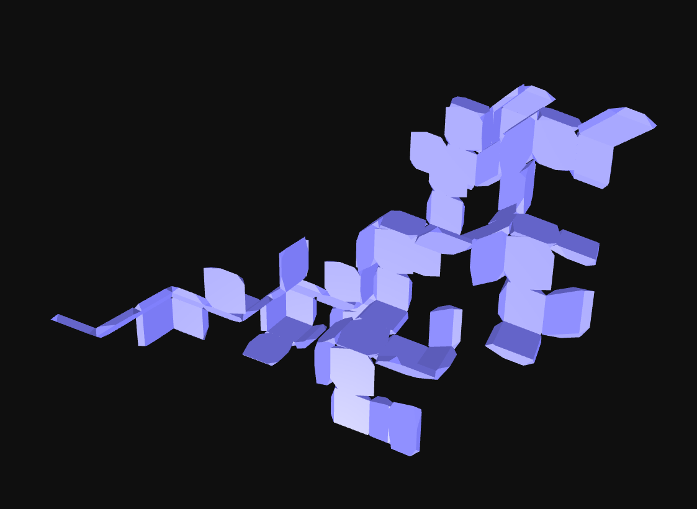

# Rhombic Panels

## Description

Rhombic panels based on the space-filling geometry of the Rhombic Dodecahedron. Developed as part of the PEEK Inventorics Project (FWF AR 730-G)

## Information

| Field | Value |
|---|---|
| Slug | `rhombic-panels` |
| Author | [Lukas Allner, Daniela Kröhnert, Naomi Neururer, Andrea Rossi](https://inventorics.com) |
| License | CC-BY-SA-4.0 |
| Tags | `inventorics` `space filling` `solids` `panels` |
| Software | v0.7... |
| Units | Centimeters |
| Parts | 1 |
| Rules | 6 |

## Files

- [aggregation.json](aggregation.json)
- [meta.json](meta.json)

---

This README was generated automatically from `meta.json`.
